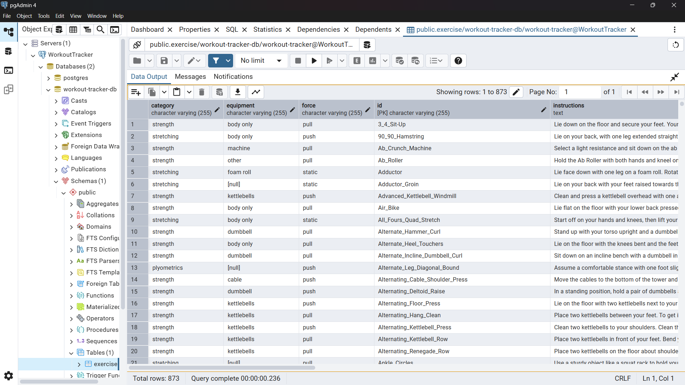

In this post, I will walk you through how a [Spring Boot](https://spring.io/projects/spring-boot) application works and integrating it with a PostgreSQL database. This is for developers who are new to Spring Boot and want to understand the basic concepts of building a web application with database connectivity.

### Prerequisites

I expect you to have a basic understanding of Java, OOPs and also Docker.

## What is Spring Boot?

Eariler, I used to think of Spring Boot as some unnecesarily complex framework that is only useful to build enterprise-grade applications. But after learning about it and using it over the past week, I realized that it is a pretty _powerful and fun framework_ that simplifies the process of building web applications, or just **'backends'**, by providing a lot of built-in features and conventional configurations that eases the development process.

### How to start?

Working with Spring Boot, and Java in general is made easy by using a powerful IDE like [IntelliJ IDEA](https://www.jetbrains.com/idea/) which I've been using since I started building Java programs. It handles the _JDK_, provides fine-grained code completion, and helps in generating a lot of common boilerplate code. You can also use other IDEs or editors, just make sure you have the JDK installed on your system.

To start a new Spring Boot project, you can use the [Spring Initializr](https://start.spring.io/) which generates the basic project structure for you (This is inbuilt in IntelliJ). You can select the dependencies you need, such as `Spring Web`, `Spring Data JPA`, and `PostgreSQL Driver`, and it will generate a ZIP file, or the whole project in case of IntelliJ. Make sure to select **Maven** as the build tool, as it is widely used in the Java ecosystem.

### Project Structure

The basic project structure of a Spring Boot application looks like this:

```
src
├── main
│   ├── java
│   │   └── com.example.demo
│   │        ├── DemoApplication.Java
│   │        └── UserRepository.java
│   └── resources
│       ├── application.properties
├── test
│   └── java
│       └── com.example.demo
│            └── DemoApplicationTests.java
└── pom.xml
```

- The `src/main/java` directory contains the Java source code of the application.
- The `src/main/resources` directory contains the configuration files and other resources.
- The `pom.xml` file is the Maven configuration file that defines the dependencies and build settings for the project.

## Main Concepts of Spring Boot

### 1. Dependency Injection

Dependency Injection (DI) is a design pattern that allows you to _inject_ dependencies, or **objects** into a class rather than creating them inside the class. This promotes loose coupling by enabling the use of _Interfaces_. In Spring Boot, DI is achieved using annotations like `@Autowired`, `@Component`, `@Service` and `@Repository`. A great _video_ to understand this pattern is [this](https://www.youtube.com/watch?v=J1f5b4vcxCQ&ab_channel=CodeAesthetic) by **CodeAesthetic**

```java
@Service
public class SoftwareEngineerService {
    private final SoftwareEngineerRepository softwareEngineerRepository;

    public SoftwareEngineerService(SoftwareEngineerRepository softwareEngineerRepository) {
        this.softwareEngineerRepository = softwareEngineerRepository;
    }

    // Other methods
```

Here, the `SoftwareEngineerService` class has a dependency on the `SoftwareEngineerRepository` class. Instead of creating an instance of `SoftwareEngineerRepository` inside the `SoftwareEngineerService` class, it gets **injected** automatically by the Spring container.

### 2. Annotations

Annotations like `@RestController`, `@GetMapping`, and `@PostMapping` are used to define the behavior of their respective classes or methods. They act _similarly to decorators_ in other programming languages, providing **metadata** about the class or method. For example, `@RestController` indicates that the class is a **RESTful** controller, and `@GetMapping` indicates that the method handles [GET](https://developer.mozilla.org/en-US/docs/Web/HTTP/Reference/Methods) requests. Annotations are a powerful feature of Java in general.

```java
@GetMapping("/")
public List<SoftwareEngineer> getSoftwareEngineers() {
    return softwareEngineerService.getAllSoftwareEngineers();
}
```

Now, since we have a basic understanding of Spring Boot, let's move on to integrating it with a PostgreSQL database.

## Integrating Spring Boot with PostgreSQL

To integrate Spring Boot with PostgreSQL, start by adding the PostgreSQL dependency to your `pom.xml` file. This will allow Spring Boot to connect to the PostgreSQL database.

```xml
<dependency>
    <groupId>org.postgresql</groupId>
    <artifactId>postgresql</artifactId>
    <scope>runtime</scope>
</dependency>
```

### Setting up the Database

I setup the PostgreSQL database using _Docker_, since this simulates a production environment better. You can pull the official PostgreSQL image from Docker Hub, and write a `docker-compose.yml` file to run the database container. Here is an example of how the file looks like, and a [guide](https://www.docker.com/blog/how-to-use-the-postgres-docker-official-image/) to customise it for your needs:

```yaml
services:
  db:
    container_name: postgres-db
    image: postgres
    restart: always
    volumes:
      - ./exercises:/data
    environment:
      POSTGRES_USER: user
      POSTGRES_DB: workout-tracker-db
      POSTGRES_PASSWORD: pass
    ports:
      - '5432:5432'
```

### Configuring the Application

Next, you need to configure the application to connect to the PostgreSQL database. This is done in the `application.properties` file located in the `src/main/resources` directory. Here is an example configuration:

```properties
spring.datasource.url=jdbc:postgresql://localhost:5432/workout-tracker-db
spring.datasource.username=user
spring.datasource.password=pass
spring.datasource.driver-class-name=org.postgresql.Driver
```

This configuration specifies the URL of the PostgreSQL database, the username and password to connect to it, and the driver class name.

### Connecting to the Database

Now, this is one of the first things that made me _love_ and understand the popularity of Spring Boot. You can simply create a repository interface that extends `JpaRepository`, specify the **Data type and the ID type**, and Spring Boot will automatically create the corresponding **table** in the database and implement the basic _CRUD_ operations for you, which can be used in your service classes. Here is an example of a repository interface for a `SoftwareEngineer` data type.

```java
public interface EngineerRepository extends JpaRepository<Engineer, Long> {
}
```

This lets you use methods like `findAll()`, `findById()`, `save()`, and `delete()` without having to write any SQL queries or boilerplate code. This is a huge time-saver, makes the code cleaner and helps you focus on the business logic rather than the database operations.

```java
public class SoftwareEngineerService {
    private final EngineerRepository engineerRepository;

    public SoftwareEngineer getEngineerById(Integer id) {
        return this.engineerRepository.findById(id)
            .orElseThrow(() -> new Exception("Engineer not found with id: " + id));
    }
}
```

The `EngineerRepository` object is _automatically injected_ into the service class, and you can use it to perform database operations.

### Pre-Loading Data

There are supposedly many ways to pre-load data into a connected database, but the method I found the most convenient, specially for _large datasets_, is to use a _Command Line Runner_. Objects of this type are **automatically run by Spring after the application has started**, and you can use it to insert data into the database by reading it from some static files like `csv` or `json` using [Jackson](https://github.com/FasterXML/jackson). Here is an example of how to use it:

```java
public class ExerciseDataLoader implements CommandLineRunner {

    private final ExerciseRepository repository;
    private final ObjectMapper objectMapper;

    public ExerciseDataLoader(ExerciseRepository repository, ObjectMapper objectMapper) {
        this.repository = repository;
        this.objectMapper = objectMapper;
    }

    @Override
    public void run(String... args) throws Exception {
        InputStream inputStream = getClass().getResourceAsStream("/exercises.json");

        TypeReference<List<ExerciseDTO>> typeRef = new TypeReference<>() {};
        List<ExerciseDTO> dtoList = objectMapper.readValue(inputStream, typeRef);

        List<Exercise> exercises = dtoList.stream().map(dto -> {
            Exercise e = new Exercise();
            e.setId(dto.id);
            e.setName(dto.name);
            return e;
        }).toList();

        repository.saveAll(exercises);
    }
}
```

The _ObjectMapper_ is used to read the JSON file and convert it into a list of usable Java objects (ExerciseDTO). The `ExerciseRepository` is then used to save the data into the database, optionally processing it by using the _Java Stream API_. This is a great way to pre-load data into the database without having to write any SQL queries.

## Seeing the Database in Action

To see the database in action, you can use a tool like [pgAdmin](https://www.pgadmin.org/) to connect to the PostgreSQL database inside the docker container and view the data. You can also use the `psql` command-line tool to run SQL queries directly on the database by accessing the container's shell using `docker exec -it postgres-db bash`.


## Conclusion

Until now, I have only scratched the surface of Spring Boot and its capabilities. There are many more features and concepts to learn, such as _Spring Security_, but being able to set up a basic Spring Boot application with PostgreSQL database integration is a pretty fun and exciting start.
