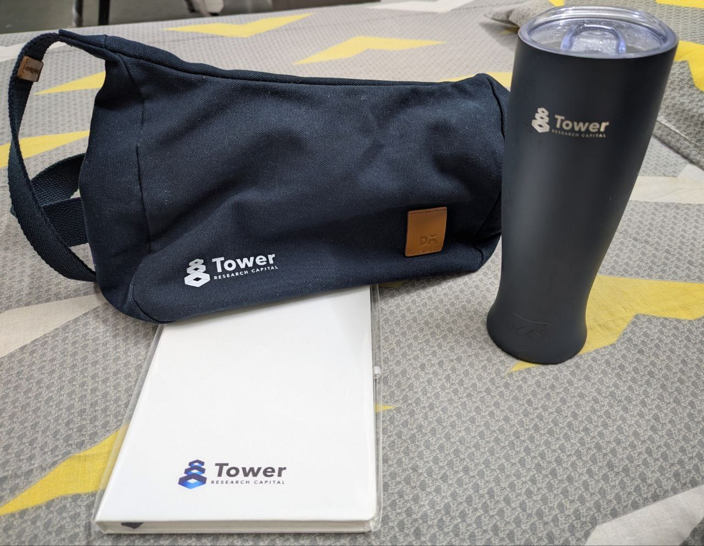

I recently interviewed for a 6-month **Core Intern** position at _Tower Research Capital_, through my campus placements cell. In this post, I will try to share my whole experience, including the Online Assessment (OA), technical interviews, and what ultimately made me stand out and **get the offer**. Hopefully, this will help you prepare better for their interviews.

## The Role and Application Process

The role TRC offered was for a Core Intern position, specifically for the **Post-Trade team**, which looked for people to work on _backend data management systems using Java, Python and shell scripting_. They were open for students in the discipline of Computer Science and Artificial Intelligence, and required a **CPI/CGPA of more than 8.5**.

<i>Fun Fact:</i> I missed the application deadline initially, but was able to apply a day later by directly contacting the placement cell.

---

## Online Assessment (OA)

TRC's OA was conducted on-campus on the HackerRank platform. It was **2 hours** long and had the following format:

| No. | Section | Questions | Topics                                   |
| --- | ------- | --------- | ---------------------------------------- |
| 1   | MCQs    | 10        | Core CS: OS, DBMS, Networking, OOPs, DSA |
| 2   | Coding  | 3         | Dynamic Programming, Graphs, Trees       |

The MCQs were a mix of easy and moderate questions, and were mostly **theoretical** or **"predict the output of the code"** style of questions. Some attention to these topics during your summers would be enough to get a decent score here. The coding questions were of **medium-hard** difficulty, and required careful attention to the input data. They could be solved using **any popular programming language**. I will recommend completing **Striver's A2Z DSA sheet** and practicing Contests to prepare for this section. Put more time in the **Pros and Cons of the various Data Structures**, **Dynamic Programming** and **Trees/Graphs** as they were the main focus for TRC's selection process.  
The shortlist came after **2 days**, and _10 students were shortlisted_ based on our performance in the OA and our resumes. They also shared a **preference order** for interviews of the shortlisted candidates.

---

## Interview Day

The interviews were rescheduled from **9 AM** initially, to an unusual _2 AM start on Day 0_, probably to compete with other Day 0 companies and take the best candidates. It was definitely a unique experience! Despite the odd timing, the process was smooth and consisted of _2-3 rounds_ with the **Senior Manager** as well as the **Head** of the team.

### First Round

The first round started with a friendly introduction. Since I mentioned my projects and experience, the interviewer was **keen to discuss them** even before moving to DSA, and we had a short talk about _Spring Boot_. This made the conversation comfortable and engaging.

#### DSA Problems

1. Design a **list like data structure** that supports **insert, delete, search at specific indices** of the list, in **$O(\sqrt{n})$ time**.
2. A variation of the question [Building Bridges](https://www.geeksforgeeks.org/dsa/dynamic-programming-building-bridges/), where the arrays represented the **heights of pillars**, and bridges can only be built between pillars of **same heights**.
3. Variation of the question [Find the Town Judge](https://leetcode.com/problems/find-the-town-judge/), where we have to find the answer in a **single pass** over the **adjacency matrix**.

I was able to solve only the ${2}^{nd}$ one completely by myself, while I needed help with the ${1}^{st}$ and ${3}^{rd}$ questions. The interviewer was very sweet and helpful, guiding me through the process. I think the most important takeaway from this round was the **importance of collaboration and thinking out loud** about the different approaches, rather than just getting the right answer.

#### Java Questions

The interview asked me if I knew about Java's **String Pool**, and since I was not very familiar with it, the interviewer opened up an online Java compiler on his laptop and explained that it is a **special memory region** where Java stores string literals. This helps in **saving memory and improving performance**.  
He then asked me about the difference between **.equals()** method and **== operator** in Java. It's important to have a **learner's attitude** if you aren't familiar with a concept and to be open to learning.

#### Project Discussion

After the DSA round, we returned to discussing my projects. The interviewer asked questions about _Java, Spring Boot, and basic design principles_. This part felt **more like a conversation** than a grilling session, and even though knowing Spring Boot isn't an absolute requirement, having a solid understanding of its concepts and a **project with it is beneficial**. We talked about the _MVC architecture_, **dependency injection**, and the **repository pattern**. He then asked me about database **sharding**, and the difference between **horizontal and vertical scaling**.

The interview ended on light-hearted note, and I asked him about any 'surprises' he had encountered while working at Tower Research. Everyone received a bag of **goodies** as well, which included **TRC branded Crossbody bag, notebook and a steel tumbler**.

---

### Second Round

The second round took place **10-15 minutes after everyone's first round was done** and was conducted by the **Senior Manager** for me. This round started with a **problem solving session** and then moved on to **experience and project discussion** and **OOPs based system design problems**.

#### DSA Problems

1. From a list of numbers $arr$, **find the first number**, from $[1, 2, 3, \ldots, max(arr)]$ that **cannot** be made by **summing up any possible set of numbers** from the list $arr$. It was hard to understand the problem statement initially, but after some clarification and walkthrough, I was able to solve it.  
I initially approached it using __dynamic programming__, but the interviewer guided me to a more optimal **greedy approach**. The key insight was that if we can form all numbers from `1` to `x-1`, and the next number in the sorted array is `<= x`, then we can also form `x` by adding that number to some subset of previous numbers. If the next number is greater than `x`, then `x` is the smallest number that cannot be formed.
2. A **Graph based problem**, which I don't remember exactly, but it was quite simple to understand and solve.

#### Project Discussion

We then talked about the project I made with **Spring Boot**, why I chose to make multiple **microservices** for the backend, and how I handled communication between them. I explained about some of the concepts of Spring like **JPA, Hibernate, and Spring Security**.

#### System Design and Operating System Problem

The interviewer asked me to use **OOPs principles** and _design the File System for a typical Operating System_. He wanted some functions like `list` and `delete` to work seamlessly on both files and folders.  
I started by identifying a class hierarchy where the `File` class would implement an `Item` **abstract** class, which would also be the parent class for the `Directory` class. This would allow for shared functionality, such as getting the size and other **attributes** of a file or directory, while still allowing for **specific behaviors in each subclass**. Then we talked about **how a file structure can be represented** in the directory class. I first thought about Java's different **implementations** of the **List** interface, like ArrayList and LinkedList. I then realised that a **Tree** would be the best data structure to represent the **hierarchy** of files and directories, and told him about making a `Node` class and storing the root node. I then talked about **interfaces**, explaining how they could be used to **define contracts between classes**.  
He then asked if I can handle dynamically adding or removing functionality from the file system, to which I explained how I could use the _Composition_ design principle to achieve this. [This video](https://www.youtube.com/watch?v=hxGOiiR9ZKg) by <i>CodeAesthetic</i> had helped me understand the benefits of composition over inheritance.  
He asked me if I know about **Databases**, and asked how **Indexing** works, to which I explained the basic concepts of indexing, like **B-Trees**, and its importance in **database performance**. He then asked me if I have done any course on **Operating Systems**. I said that I'm taking it in the current semester and he was fine with it and did not ask any questions.

Finally, I asked him a question on whether **TRC** has any proprietary database system for their data since they mainly worked with **time-series** data only. He replied that they mainly used **elasticsearch** and other open-source tools only.

---

### Third Round

The Third round was conducted by the _Head_ of the **Post-Trade** team. It was more of a informal discussion and was quite fast-paced. He asked me some good questions about my **Spring Boot** project and **JWTs**. We then discussed about **2 system design problems** and ended with some advice for me.

#### Project Discussion

We talked about how I implemented **JWT-based authentication** in my project. He asked me to explain what _JWTs_ are and how they work. I described the structure of a JWT, including the **header, payload, and signature**, and explained how they are used for **stateless** authentication. He then asked how the signature helps in verifying the authenticity of the token, to which I explained the role of the **secret key** in the signing process. He also asked me which encryption algorithms I used for signing the JWTs, and I initially forgot the name and said _RSA_ but he pointed out that RSA is an **asymmetric** algorithm and then I correctly mentioned that I used _HmacSHA256_, which is a **symmetric** algorithm.

#### System Design Problems

We then discussed two system design problems. The first one transitioned from the JWT discussion, where he asked how I would design a _system to handle user authentication using JWTs_ at scale. Firstly, I designed and explained a single **JWTService** class with **Spring MVC Annotations** and **Spring Security** features. We treated the exact implementation logic as a black box, focusing on the overall architecture. He asked me what I would do to **scale the system to handle a large number of users** and requests. I suggested using techniques like **load balancing** and **database sharding** to improve performance and scalability.  
He then asked me to make a simple _online book publishing system_. He wanted the **database schemas**, and **Service classes with relevant endpoints**. I made a **Users** table with fields like `id`, `name`, and `password` mentioning that passwords should be hashed, and a **Books** table with fields like `id`, `title`, `authorId`, `content`, and `is_published`. I then created a repository class to have methods like `getBooksByUserId()`, `getUser()` and `getPublishedBooks()`. I also wrote service methods like `publishBook()`. He seemed satisfied and focused on optimising the way in which **data would be handled in a real application**.

He then mentioned some **concepts and tools that I should learn** to perform better in the internship <i>(yeah, I was getting selected)</i>. He also emphasised on learning the **core technology behind any tool** and becoming a complete engineer. He ended the interview by saying that he was **very interested in selecting me** for the internship.

---

## Conclusion

After the third round, **I was over the moon**. The interview process had been rigorous, but I felt that I had showcased my skills and knowledge effectively. The positive feedback from the interviewers and their interest in my background **gave me confidence** that I was a strong candidate for the internship.  
I met with the interviewers again in the breakout area, where I talked with the Head again to get his proper introduction, since he didn't give one during the interview. They submitted their **final preference list** after a few hours, and **I was thrilled and humbled to find out that I was their top choice**.

The entire experience was **challenging** yet rewarding, and I learned that **maintaining your composure and confidence is key** during interviews. A **strong grasp of DSA fundamentals** is essential, and having a _record of working on multiple good projects_, preferably **outside of coursework**, can significantly boost your chances in companies like Tower Research Capital, where **interns are highly valued and actually given real work**.  
Needless to say, some experience with **Java** and enterprise frameworks like **Spring Boot** will definitely help you _stand out_. I hope this detailed account of my interview experience **helps you** prepare better for your own interviews at TRC or similar companies. _Good luck!_
